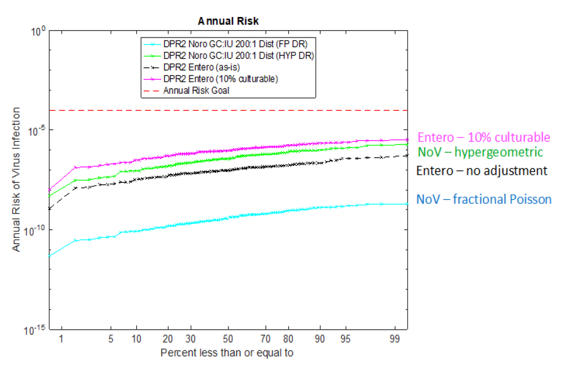

# Probit Risk Graph
A graph for probabilities of illness, with y axis being probability of illness, and x axis being percentile in the probit style to highlight extreme values. Another way of graphing a distribution.
I was inspired by the following figure to create a version using R. I haven't finished all of the way, with my main issues remaining being the legend, and adding a risk goal line.

The two types of figures to create with this code are below. 
A single probability of illness:

Multiple probabilities of illness:

## Installation
Click download in the upper right hand corner.

## Usage example
The included file is an example list of probabilities of illness from Campylobacter through three different exposures to the Las Vegas Wash. You can recreate my graphs above using this file before striking out on your own.

## Meta

 [@katcrank](https://twitter.com/katcrank) – katherine.crank@snwa.com

## Contributing
If you are interested in updating this code with better versions, see below:

1. Fork it (<https://github.com/kcrank1/Probit_Risk_Graph/fork>)
2. Create your feature branch (`git checkout -b feature/Probit_Risk_Graph.R`)
3. Commit your changes (`git commit -am 'Add some changes'`)
4. Push to the branch (`git push origin feature/Probit_Risk_Graph.R`)
5. Create a new Pull Request

